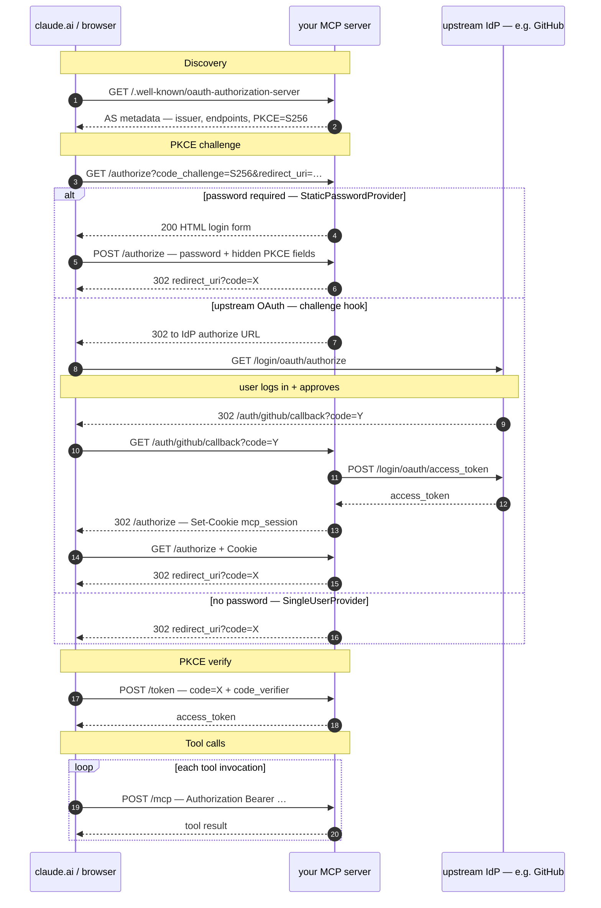

# mcp-oauth-template

Generic MCP server with OAuth 2.1 PKCE for claude.ai.  
Build any MCP service in ~30 lines. Deploy to Cloud Run in one command.

---

## Structure

```
mcp_server/
  __init__.py        -- Public API
  auth.py            -- PKCE + TokenStore + AuthProvider (+ challenge hook)
  oauth_routes.py    -- OAuth 2.1 AS endpoints
  app.py             -- FastAPI factory (wires everything)
  context.py         -- Per-request `current_sub` for tool code

examples/
  polymarket_server.py    -- No-auth example (Polymarket markets)
  github_oauth_server.py  -- Per-user upstream OAuth (GitHub)

tests/
  test_oauth.py         -- Full PKCE flow + edge cases
  test_github_oauth.py  -- GitHub provider + callback logic
```

---

## Quick Start

### 1. Install

```bash
pip install .
```

### 2. Build your MCP server

```python
# my_service.py
import fastmcp
from mcp_server import create_app

mcp = fastmcp.FastMCP(
    "my-service",
    instructions="Describe what your server does — shown as the connector card in claude.ai.",
)

@mcp.tool()
def my_tool(query: str) -> str:
    return f"Result for: {query}"

app = create_app(mcp=mcp)
```

### 3. Run locally

```bash
uvicorn my_service:app --reload --port 8080
```

### 4. Test OAuth discovery

```bash
curl http://localhost:8080/.well-known/oauth-authorization-server | jq
```

### 5. Deploy to Cloud Run

```bash
chmod +x deploy.sh
./deploy.sh my-service europe-west1
```

### 6. Add to claude.ai

Settings → Connectors → Add MCP Server  
URL: `https://my-service-xxxx.run.app/mcp`

Claude.ai will handle the OAuth PKCE flow automatically.

---

## Auth Modes

### Single-user (default, no login)

```python
app = create_app(mcp=mcp)
# /authorize issues code immediately -- protect at network level
```

### Single-user with password

```python
from mcp_server import create_app, StaticPasswordProvider
import os

app = create_app(
    mcp=mcp,
    provider=StaticPasswordProvider(os.environ["ADMIN_PASSWORD"])
)
```

Set `ADMIN_PASSWORD` env var on Cloud Run. claude.ai redirects the user's browser to `/authorize`; the server renders a password form; after submit, the OAuth code is issued and the PKCE flow completes.

### Multi-user (upstream OAuth)

Subclass `AuthProvider`:

```python
from mcp_server.auth import AuthProvider
from starlette.requests import Request

class GoogleAuthProvider(AuthProvider):
    def authenticate(self, request: Request, credentials: dict[str, str]) -> str | None:
        # `request` gives access to headers/cookies for session-based auth.
        # `credentials` merges /authorize query params + POST form fields.
        # Return user sub or None.
        ...
```

### Upstream OAuth (per-user identity)

Each claude.ai user logs in through an external identity provider (GitHub,
Google, etc.) and subsequent tool calls run with **their own** upstream
token — not a shared one. The server maintains an allowlist of permitted
users. Override `AuthProvider.challenge()` to redirect unauthenticated
users to the IdP; your callback route exchanges the code for a token,
sets a session cookie, and bounces the user back into `/authorize`. Tools
read the caller's identity via `mcp_server.get_current_sub()` and look up
the per-user token from a session store.

See [`examples/github_oauth_server.py`](examples/github_oauth_server.py)
for a complete, working GitHub implementation (`whoami`, `list_my_repos`,
`get_starred` — each executes as the caller).

---

## OAuth 2.1 Flow (what claude.ai does)



---

## Security Notes

- `SingleUserProvider` with no password: protect `/authorize` via Cloud Run IAM or VPN if not behind a login
- `StaticPasswordProvider`: use a strong random password, rotate via env var
- Token store is in-memory -- tokens lost on restart; users re-auth automatically (PKCE flow is fast)
- For production multi-user: replace `TokenStore` with a Redis or SQLite-backed implementation
- `state` parameter is passed through but not validated in `SingleUserProvider` mode -- add validation for multi-user

---

## Tests

```bash
pip install pytest httpx
pytest tests/ -v
```
